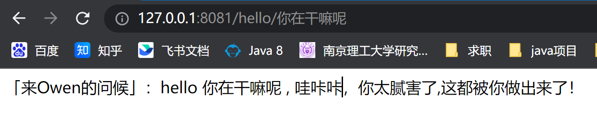

# easyRpc
一个简易的RPC服务，通过学习该项目可以很好的了解RPC服务流程，并掌握以下内容：
1. 了解NIO网络通信，Netty框架入门
2. 学会注解开发，使用注解以及自定义注解
3. Spring类加载过程，熟悉Spring类的生命周期
4. 掌握动态代理，以及工厂设计模式
5. 了解ZooKeeper分布式接口管理，简单使用ZooKeeper
6. Spring事件监听
7. 如何自定义一个Spring启动加载项目

# 快速开始

## 环境准备
- JDK8 或以上
- Maven 3
- Zookeeper 单机或者集群实例
## 编译安装源码
下载项目，开启Zookeeper服务

## 测试
开启本地服务：
```java
@RestController
public class HelloController {
    private static final Logger logger = LoggerFactory.getLogger(HelloController.class);

    // 通过自定义注解注入远端服务
    @ServiceReference
    private HelloService helloService;
    @GetMapping("/hello/{name}")
    public String hello(@PathVariable String name) {
        //调用远程服务
        final String rsp = helloService.sayHello(name);
        logger.info("Receive message from rpc server, msg: {}", rsp);
        return rsp;
    }
}
```
开启远程服务(另一个项目模拟远程服务)

```java
@ServiceExpose
public class HelloServiceImpl implements HelloService {
    public String sayHello(String name) {
        return "「来Owen的问候」：hello " + name + " , 哇咔咔，你太腻害了" +
                ",这都被你做出来了！";
    }
}
```
使用浏览器输入请求地址测试：
```text
http://127.0.0.1:8081/hello/输入测试字符串
```
返回：表示成功


## 如何在自己项目中使用？
1. 将项目打包安装在本地maven库中
2. 在自己项目中使用引入
```xml
<dependency>
     <groupId>com.jia</groupId>
     <artifactId>easy-rpc-spring-boot-starter</artifactId>
     <version>0.0.1-SNAPSHOT</version>
</dependency>
```
3. 按照提供的测试代码编写服务端
4. 服务端配置
当前项目只支持 zookeeper 作为注册中心。服务端（provider）使用 zookeeper 管理接口。
```properties
#配置RpcServer
rpc.server.zk-address=127.0.0.1:2181

```
```java
@ServiceExpose
public class HelloServiceImpl implements HelloService {
    public String sayHello(String name) {
        return "「来Owen的问候」：hello " + name + " , 哇咔咔，你太腻害了" +
                ",这都被你做出来了！";
    }
}
```

5. 客户端配置
使用自定义注解 @ServiceReference 自动注入服务端暴露的接口服务

客户端配置 zookeeper 是为了订阅发现服务端暴露的服务接口
```properties
# spring Tomcat 容器端口
server.port=8081
#连接zookepper 设置
rpc.zk.connection-string=127.0.0.1:2181
rpc.zk.sessionTime=60000
rpc.zk.connectionTime= 15000

```
```java
@RestController
public class HelloController {
    private static final Logger logger = LoggerFactory.getLogger(HelloController.class);

    // 通过自定义注解注入远端服务
    @ServiceReference
    private HelloService helloService;
    @GetMapping("/hello/{name}")
    public String hello(@PathVariable String name) {
        //调用远程服务
        final String rsp = helloService.sayHello(name);
        logger.info("Receive message from rpc server, msg: {}", rsp);
        return rsp;
    }
}
```
6. 测试
使用浏览器输入请求地址测试：
```text
http://127.0.0.1:8081/hello/输入测试字符串
```
返回下面的字符串就说明运行成功


